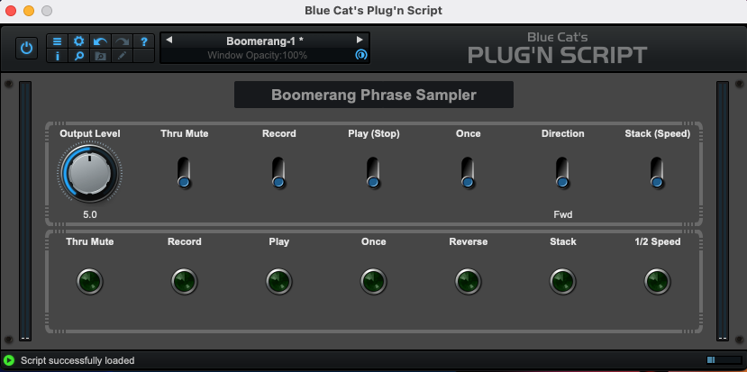

# Boomerang+ Emulator

VST/AU plugin based on the Boomerang+ Phrase Sampler.

## Background

Way back when, I had an original Boomerang+ Phrase Sampler. Before it was cool; chiefly inspired by Trey Anastasio's use of one.

There aren't any close emulations in plugin-land. So I had to create my own.

The Boomerang is a special device because it is, in my opinion, the perfect combination of simple and powerful.

It epitomizes the way of "Perfect is not when there is nothing more to add; rather, it is when there is nothing more to take away."

Every other looper plugin on the market is too complicated.

So to that end I set about to figure out how to make a plugin that perfectly emulates the unique layout and behavior of this singular piece of gear.

It's done with love and reverence for the creators and keepers of the original device, and I have reached out to them for approval/partnership.

### Design Approach

My intention is to use the manual very much as a requirements document; to code this plugin to behave as close to the physical original as I can, with my limited time and knowledge of the programming domain of this code.

In the future it could be considered to add features or modify the behavior in ways that may show themselves to be useful. For now, I am not thinking too much about improvements.

### MIDI Concerns, Switch Types, and the UI

The original device uses momentary switches and has no MIDI capability. Due to the way the software identifies switch presses, the plugin will use latching switches and will have MIDI capability.

The software runs the "a parameter has changed, go check it out" script on any change of the switch state. But then it checks the state and status of _every_ switch. So we have to keep a state of every switch and only act if the state has changed.

We work with the assumption of a physical device, that only one button will be pressed at a time.

The other factor to consider is how the MIDI messages are sent and received. I use a [Paint Audio MIDI Captain, which is highly programmable](https://paintaudio.com/products/midi-captain-std-vesion-black), but has no way of knowing the state of the software device. As far as I know, there is no way for this pedal to _receive_ MIDI messages from the software. Other, more expensive pedals do have this capability. [I am including the configuration file for the pedal as a reference,](midi/page2.txt) but you may have to build your own depending on your hardware.

To that end, I have tried to make the plugin buttons and LEDs behave as they would on the physical device, without considering the MIDI aspect. On the other hand, you have to understand how the device will behave when configuring your MIDI controller.

Another way of looking at it is that the physical switches all appear to be momentary switches, but some features act as if they are latching on/off, like the record and play buttons; others like the once and stack buttons act as momentary switches.

Regarding the LEDs in the plugin, they're a bit extraneous, since the controls have their own visual feedback. But I have included them for completeness to make the plugin look more like the original device.

## Current Status

Here is what the GUI looks like now:

## Building

The script is auto-reloadable in the UI.

Exporting is also done in the UI, so there's no build process to manage that I'm aware of.

### Prerequisites

- [Blue Cat Audio Plugin SDK](https://www.bluecataudio.com/Doc/Product_PlugNScript/)

### Source Code Attribution

As a starting point, I am using the `looper.cxx` script that comes with the PNS software download. So the architecture of the code is not mine.

I have modified the code to add and remove features and behaviors that are not needed for the emulation of the original device.

As time allows I plan to refactor the code to make it more readable and reuseable.

### Source Code

You can view and download the source code at <https://github.com/mcascone/boomerang-plugin.git>

# The Controls

The original manual has the best description of each control, so I am copying here verbatim. The following text is 100% copied from the manual, and only formatted by me.

## How the Buttons Work

While most of the functions provided by the Boomerang Phrase Sampler are fairly obvious, it is helpful to describe each foot switch button in some detail as there are several hidden features you will want to know about. In particular, the order and combination of button presses alter some of the functions, and a brief read through these descriptions may help save you some time. If things do happen to get a little out of control just remember to push the STOP button and take a second to collect your thoughts.

Just so we are all on the same page, the buttons with a second label in parentheses may be referenced by either name.

### RECORD

This button is probably the most used of all. When it is pressed, recording begins and the RECORD LED lights up brightly. A second press ends the recording and the Boomerang Phrase Sampler begins playing back; the PLAY LED lights up brightly to indicate the change. If no other buttons are pressed, playback will continue indefinitely, repeating over and over the sounds recorded during the time between the two button presses. During playback the RECORD button can be pressed again and a new recording will begin. Recording erases any previously stored sounds. During playback the RECORD LED will blink briefly at the beginning of the loop each time it comes around; this helps in identifying the loop start point for stacking additional parts.

If the system reaches the end of available memory during recording, a special mode will be entered where all LED's are turned on brightly; then the user must press either RECORD or PLAY. Pressing RECORD will begin a new recording and the previous one will be lost. Pressing PLAY initiates playback and preserves the recorded material.

### PLAY (STOP)

This button has different functions depending on what the Boomerang Phrase Sampler is currently doing, hence the two-part name. If the Rang is recording, pressing STOP halts the recording and the unit becomes idle; your music is recorded and ready for playback. If the Rang is playing back, pressing STOP halts playback and the unit becomes idle.

If the Boomerang Phrase Sampler is idle, pressing PLAY starts playback of whatever was last recorded, in a continuously looping manner. During playback the PLAY LED will be on and the RECORD LED will blink at the beginning of each pass through the loop.

### ONCE

As with the previous buttons, this one has different functions depending on what the Boomerang Phrase Sampler is currently doing. Pressing ONCE while recording will halt recording and initiate an immediate playback of the signal just recorded, but the loop will playback only once. Pressing ONCE during playback tells the Boomerang Phrase Sampler to finish playing the loop and then stop. This is handy for terminating a loop without abruptly stopping it in the middle, which would happen if the STOP button was pressed. If the Boomerang Phrase Sampler is idle, pressing ONCE will playback your recorded loop one time. After pressing this button, the ONCE LED will be turned on letting you know this is the last time through your loop.

There is an interesting twist in the way the ONCE button works. Pressing it while the ONCE LED is on will always immediately restart playback. Repeated presses produces a stutter effect sort of like record scratching.

The first three buttons, RECORD, PLAY and ONCE, were designed to provide any possible sequence of actions: record followed by looping, record and then stop, record and then playback once, playback once and then stop, etc.

### DIRECTION

The DIRECTION button does just what you think... most of the time. If the unit is playing back, pressing this button will immediately reverse the direction through your loop, resulting in reversed audio output. DIRECTION can be pressed any number of times during playback with a resulting instantaneous reversal of playback direction with each press. Try this with recorded speech; it’ll crack you up!

If the DIRECTION button is pressed so the REVERSE LED is on before the recording process begins, a special continuous-reverse mode can be entered where the system is continually re-recording new sound while simultaneously playing the previously recorded sounds in reverse. Press the RECORD button twice to define a recording length and then start jamming. Both the RECORD and PLAY LED’s will become brightly lit, along with the REVERSE LED, to denote this unique mode. This produces a continuous, reversed output as the user continues to play and provide the ‘Rang with new licks. Turn off the through signal by pressing the THRU MUTE switch so that only the reversed signal is present and you can play a reverse solo live! It is usually best to define a relatively short loop for this purpose so you are playing just a little ahead of the accompaniment so chord changes can be easily anticipated. I recommend one or two measures. But, as with all features of the Boomerang Phrase Sampler, there are no rules and experimentation is the name of the game.

If DIRECTION is pressed during the recording process the system will be armed to enter the reverse playback mode immediately at the point when the end of the loop is defined by the second press of the RECORD button.

### STACK (SPEED)

***This is not working yet***

This button has two main functions. If the unit is idle, it selects the sample rate: full or half speed. Full speed offers twice the bandwidth but reduces the recording time available. Half speed offers double recording time at the expense of bandwidth. The user can decide which mode to use based on his needs at the time. Sounds recorded at full speed may be played at half speed by stopping the system and changing the speed before the next playback. This is handy when trying to learn difficult licks from a CD or tape. Signals recorded at half speed may also be played back at full speed with a resulting chipmunk effect. Stacking on a bass line is also possible by recording at half speed and adding the bass line at full speed. When the result is played back at half speed the bass line will be dropped an octave.

If STACK is pressed during playback, the system will accept additional input and add it to the existing loop so that on the next pass through the loop, both parts will playback together. This stacking of parts will continue for as long as the STACK button is held down. This is different than the other buttons, which are operated with a single tap. There is no hard limit to the number of parts that can be added in this manner, in fact a whole song can be created in just a few minutes by stacking on various parts, one by one. If the Boomerang Phrase Sampler is connected to a small mixing console, different instruments and microphones can be easily selected and added to the mix. By controlling the relative levels of each new addition the final result will sound well balanced; this is an experience thing. Also note that the stacking feature works during reversed playback so any part can be recorded forward or reversed.

Since the stacked signals are being added together, there is a practical upper limit to how large they can grow after repeated stacking. The user should be aware that the system will internally attenuate the original loop by about 2.5dB to help insure no overloading will occur. It may take a little practice, but once you find the best settings stacking will be easy and predictable.

Since the system is slightly attenuating the loop signal while the STACK button is pressed, if the STACK button is held down but no new signal is input, the result will be a very smooth fade-out of the recorded loop. This can be cool.

If the loop is very short and the STACK button is held down while you continue to play, the effect is essentially the same as that of a conventional delay with a very slow decay setting. The OUTPUT LEVEL roller then becomes the effect/clean mix control. The cool thing is that the delay time is precisely controlled by two presses of the RECORD button, so it will be just what you need at the moment.

### THRU MUTE

The THRU MUTE foot switch, on the upper-left front panel, turns the through signal on or off and can be changed at any time as it is purely an analog connection. Typically the through path will be enabled, but for special situations, the through path can be turned off allowing only the sampled audio to be heard. This is useful when the user wants to play along with the loop but not have the original signal present.

The THRU MUTE switch is also useful when the user wants to play a reverse solo live. The through signal can be turned off and the REVERSE LED will be on, indicating that only the reversed signal is present. This is a very cool effect and is a lot of fun to play with. The user can also play along with the reversed signal and the through signal at the same time, creating a very unique sound.

### OUTPUT LEVEL

_**Not sure I have the math correct on this one**_

The OUTPUT LEVEL roller on the front panel of the Boomerang Phrase Sampler controls the playback volume but has no effect on the through signal. The output level can be adjusted at any time and is not stored in memory. The OUTPUT LEVEL roller is a high quality, sealed potentiometer and is very smooth in operation. The output level can be adjusted from zero to full output and is very useful for balancing the loop with the through signal. The OUTPUT LEVEL roller is also useful for setting the level of the loop signal when the THRU MUTE switch is turned off and only the loop signal is present.
